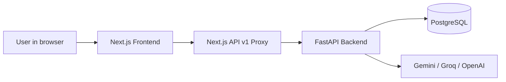
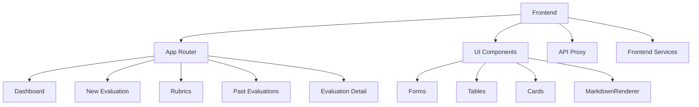
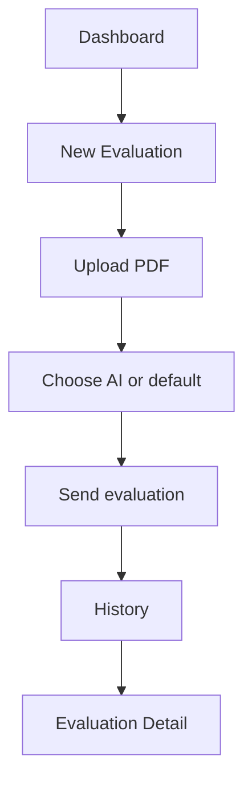
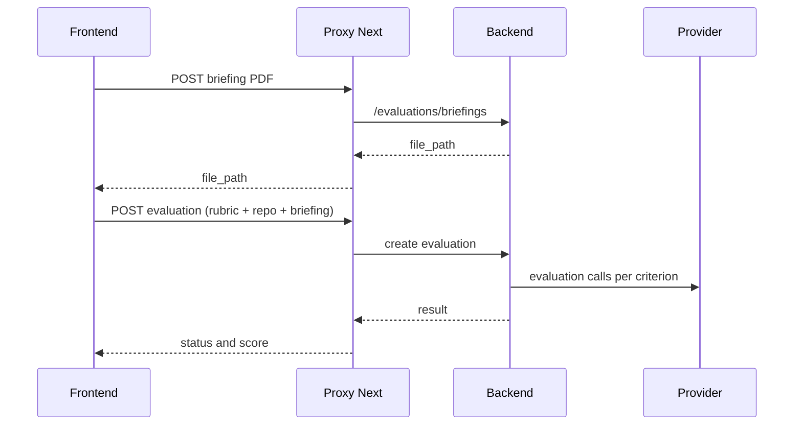

<div align="center">


# EvaluAI Frontend

### Web interface for evaluating repositories with AI and custom rubrics

[](https://nextjs.org/)
[](https://react.dev/)
[](https://www.typescriptlang.org/)
[](https://tailwindcss.com/)
[](#-architecture-explained-easily)
[](#-how-it-connects-to-the-backend)

</div>

---

<div align="center">

### Quick Navigation

[](#-quick-reading-guide)
[](#-architecture-explained-easily)
[](#-pages-and-what-each-one-does)
[](#-component-gallery)
[](#-how-it-connects-to-the-backend)
[](#-what-has-been-done-in-this-frontend)
[](#-responsive-and-mobile-ux)

</div>

---

## 👋 Quick reading guide

If you're new to the project, follow this order:

1. Read [Pages and what each one does](#-pages-and-what-each-one-does).
2. Look at [How it connects to the backend](#-how-it-connects-to-the-backend).
3. Review [Component gallery](#-component-gallery).
4. Run the project with [Run local](#-quick-local-run).

### One-sentence summary

The frontend allows creating repository evaluations, sending data to the backend, and displaying AI results in a clear and responsive manner.

---

## 🎯 What this frontend solves

This web application allows:

- Creating new evaluations using a rubric.
- Uploading a briefing in PDF format.
- Choosing an AI provider/model (or using server defaults).
- Viewing evaluation history with search, filters, and CSV export.
- Opening detailed evaluation reports and reading findings/suggestions in markdown.
- Creating and editing rubrics, criteria, and levels.

---

## 🧭 Architecture explained easily



### Why this approach?

- The browser only calls `localhost:3000`.
- The frontend forwards requests to the backend from the server (proxy).
- Avoids CORS issues and prevents exposing internal Docker hostnames.

### Visual module map



---

## 🧩 Tech Stack

| Area | Technology | What it's used for |
|---|---|---|
| Framework | Next.js 16.1.6 | Routes, layouts, route handlers |
| UI | React 19.2.3 | Components and state |
| Language | TypeScript 5.x | Typing and maintenance |
| Styles | Tailwind v4 | Fast and responsive design |
| Markdown | react-markdown + remark-gfm | AI report rendering |
| HTTP | fetch (primary), Axios (available client) | API communication |
| Charts | Recharts | Dashboard KPIs |
| Icons | Lucide React | Consistent iconography |

---

## 📄 Pages and what each one does

| Route | What the user sees | What it does technically | File |
|---|---|---|---|
| `/dashboard` | KPIs, most used rubric, recent evaluations | Loads metrics and latest records | `app/(app)/dashboard/page.tsx` |
| `/new-evaluation` | New evaluation form | Uploads PDF, builds payload, sends POST | `app/(app)/new-evaluation/page.tsx` |
| `/rubrics` | List/edit rubrics | CRUD of rubrics, criteria, and levels | `app/(app)/rubrics/page.tsx` |
| `/past-evaluations` | History with filters | Searches, filters, exports CSV, polling | `app/(app)/past-evaluations/page.tsx` |
| `/past-evaluations/[id]` | Detailed report | Gets evaluation + rubric and renders markdown | `app/(app)/past-evaluations/[id]/page.tsx` |

### User flow



---

## 🧱 Component gallery

### Main UI components

| Component | Main use |
|---|---|
| `Button` | Primary and secondary actions |
| `Input` / `Textarea` | Form inputs |
| `Select` | Provider/model/rubric selection |
| `FileUpload` | PDF briefing upload |
| `Card` | Visual blocks for dashboard/report |
| `Badge` | Status and metadata labels |
| `Alert` | Success/error messages |
| `Table` | History and data lists |
| `StatCard` | KPI cards |
| `MarkdownRenderer` | Summary/findings IA render |
| `RubricBuilder` | Rubric editor |

### Layout and navigation

| Component | Function |
|---|---|
| `MainLayout` | Main app shell |
| `Sidebar` | Sidebar menu (desktop + mobile drawer) |
| `PageHeader` | Standard header for each view |
| `Container` | Width and spacing control |

### Quick example (realistic)

```tsx
import { Card, CardContent, Badge, Button, Alert } from '@/components/ui';

<Card className="rounded-xl border border-gray-200">
  <CardContent className="space-y-4">
    <div className="flex items-center justify-between">
      <h3 className="text-lg font-semibold">Evaluation status</h3>
      <Badge variant="success">Completed</Badge>
    </div>

    <Button variant="primary">View report</Button>
    <Alert variant="success" message="Evaluation loaded successfully" />
  </CardContent>
</Card>
```

---

## 🔌 How it connects to the backend

### Key idea

Frontend pages call relative routes, for example:

- `/api/v1/evaluations/`
- `/api/v1/rubrics/`
- `/api/v1/evaluations/briefings`

They don't call `http://backend:8000` directly from the browser.

### Who acts as the bridge?

- File: `app/api/v1/[...path]/route.ts`
- This route handler acts as a server-side proxy.

### Advantages

- Fewer CORS issues.
- Greater security in headers and redirects.
- Same URL for frontend in local and Docker.

### fetch or axios

- Today we mainly use `fetch` in pages.
- There's `lib/api/client.ts` with Axios for future standardization.

---

## 🤖 Evaluation data flow (simple)



AI behavior from frontend:
- If you don't choose provider/model, uses backend defaults.
- If you choose provider/model, they are sent explicitly.
- If the user adds an API key, it's sent via `X-API-Key`.

---

## ✅ What has been done in this frontend

### Functional

- Fixed sending `ai_provider` and `ai_model` from new evaluation.
- Fixed optional sending of `X-API-Key`.
- Aligned provider to `groq` in types and UI.
- Maintained server defaults behavior when applicable.

### UX and responsive

- Mobile spacing improvements in dashboard and evaluations.
- Better text/links/code wrapping in markdown.
- Better table behavior and long content on mobile.
- Adjustments in badges/metadata to avoid breaking layout at 320px.

### Technical quality

- Documented robust proxy.
- Restructured README for clearer and faster onboarding.
- Clearer troubleshooting and operation guide.

---

## 📁 Project structure

```text
frontend/
├── app/
│   ├── layout.tsx
│   ├── page.tsx
│   ├── (app)/
│   │   ├── layout.tsx
│   │   ├── dashboard/page.tsx
│   │   ├── new-evaluation/page.tsx
│   │   ├── rubrics/page.tsx
│   │   ├── past-evaluations/page.tsx
│   │   └── past-evaluations/[id]/page.tsx
│   ├── api/v1/[...path]/route.ts
│   └── components-demo/page.tsx
├── components/
│   ├── layout/
│   └── ui/
├── lib/
│   ├── api/client.ts
│   ├── services/file-upload.ts
│   └── utils/
├── hooks/
├── public/
├── types/
├── next.config.ts
├── package.json
└── README.md
```

---

## ⚙️ Environment configuration

Create your environment file:

```bash
cp .env.example .env
```

| Variable | Where it applies | What it does | Default value |
|---|---|---|---|
| `BACKEND_URL` | Server-side only | Proxy target URL | `http://backend:8000` |

Best practices:
- Don't store sensitive API keys in frontend.
- Keep secrets in backend or user runtime input.

---

## 🚀 Quick local run

```bash
npm install
npm run dev
```

Open:
- `http://localhost:3000`

Other commands:

```bash
npm run build
npm run start
npm run lint
```

---

## 🐳 Docker (dev and prod)

### Development

- `Dockerfile.dev`
- Node 20-slim
- Hot reload with volumes
- Port 3000

### Production

- `Dockerfile.prod`
- Multi-stage standalone build
- Non-root user
- Healthcheck

If you change environment variables, recreate container:

```bash
docker compose -f docker-compose.dev.yml up -d --force-recreate frontend
```

---

## 🐳 Docker-in-Docker Support

This project supports Docker-in-Docker for CI/CD environments and development workflows. The management script (`manage.sh`) provides container orchestration for frontend development:

```bash
# Start all services with Docker-in-Docker support
./manage.sh all

# Rebuild all images from scratch (includes frontend)
./manage.sh rebuild
```

### Frontend-specific Commands

For frontend development, use these management script commands:

- `all` - Start all services (includes frontend)
- `rebuild` - Rebuild all images from scratch (includes frontend)
- `stop` - Stop all services

---

## 📱 Responsive and mobile UX

Applied improvements:
- Mobile drawer in navigation.
- Adaptive paddings in critical views.
- Hardened markdown render for long content.
- Better readability in evaluation detail (320px).

Manual checklist:
- Viewport 320x824
- Review `/dashboard`, `/past-evaluations`, `/past-evaluations/[id]`
- Confirm no unexpected horizontal clipping

---

## 🛠️ Troubleshooting

### Backend doesn't respond

- Check backend container.
- Check `BACKEND_URL`.
- Check proxy route handler logs.

### I don't see frontend changes

1. Hard refresh (`Ctrl+Shift+R`).
2. Restart frontend.
3. If you changed env, use recreate (`--force-recreate`).

### AI provider authentication error

- Verify active variables inside backend container.
- Check for duplicate keys in `.env`.
- Verify if `X-API-Key` is overriding server key.

---

## 🤝 Contribution

1. Create branch from `main`.
2. Reuse existing components before creating new ones.
3. Keep API calls relative to `/api/v1`.
4. Add screenshots when there are UI changes.

---