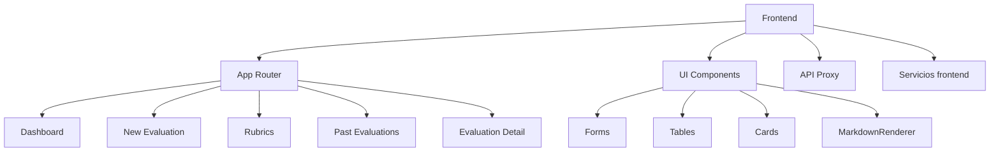
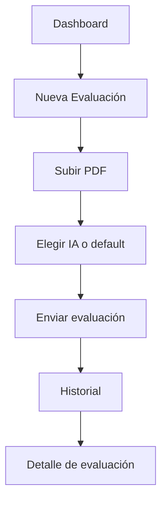
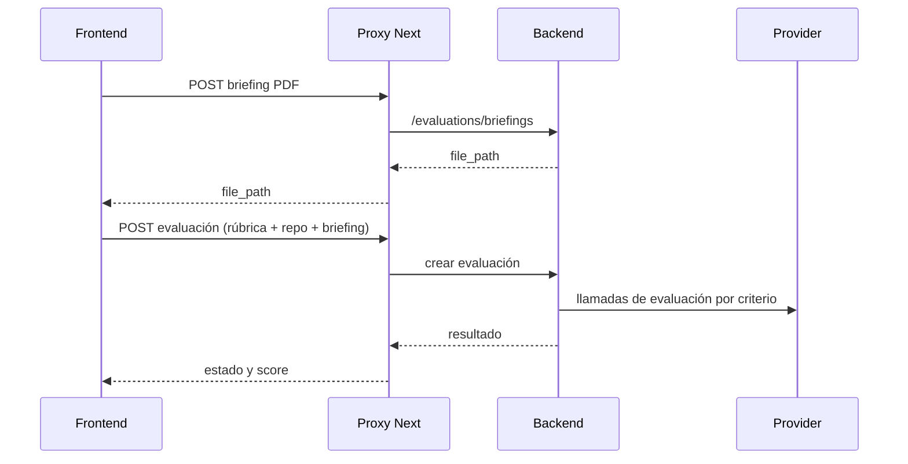

<div align="center">


# EvaluAI Frontend

### Interfaz web para evaluar repositorios con IA y rúbricas personalizadas

[](https://nextjs.org/)
[](https://react.dev/)
[](https://www.typescriptlang.org/)
[](https://tailwindcss.com/)
[](#-arquitectura-explicada-fácil)
[](#-cómo-se-conecta-con-el-backend)

</div>

---

<div align="center">

### Navegación Rápida

[](#-guía-rápida-de-lectura)
[](#-arquitectura-explicada-fácil)
[](#-páginas-y-qué-hace-cada-una)
[](#-galería-de-componentes)
[](#-cómo-se-conecta-con-el-backend)
[](#-qué-se-ha-hecho-en-este-frontend)
[](#-responsive-y-ux-móvil)

</div>

---

## 👋 Guía rápida de lectura

Si conoces poco el proyecto, sigue este orden:

1. Lee [Páginas y qué hace cada una](#-páginas-y-qué-hace-cada-una).
2. Mira [Cómo se conecta con el backend](#-cómo-se-conecta-con-el-backend).
3. Revisa [Galería de componentes](#-galería-de-componentes).
4. Ejecuta el proyecto con [Run local](#-run-local-rápido).

### Resumen en una frase

El frontend permite crear evaluaciones de repositorios, enviar datos al backend, y mostrar resultados de IA de forma clara y responsive.

---

## 🎯 Qué resuelve este frontend

Esta aplicación web permite:

- Crear evaluaciones nuevas usando una rúbrica.
- Subir un briefing en PDF.
- Elegir proveedor/modelo de IA (o usar valores por defecto del servidor).
- Ver historial de evaluaciones con búsqueda, filtros y exportación CSV.
- Abrir el detalle de una evaluación y leer hallazgos/sugerencias en markdown.
- Crear y editar rúbricas, criterios y niveles.

---

## 🧭 Arquitectura explicada fácil

```mermaid
flowchart LR
  U[Usuario en navegador] --> FE[Next.js Frontend]
  FE --> PX[/api/v1 Proxy en Next.js]
  PX --> BE[FastAPI Backend]
  BE --> DB[(PostgreSQL)]
  BE --> AI[Gemini / Groq / OpenAI]
```

### ¿Por qué así?

- El navegador solo llama a `localhost:3000`.
- El frontend reenvía las peticiones al backend desde el servidor (proxy).
- Evita problemas de CORS y evita exponer hostnames internos de Docker.

### Mapa visual de módulos



---

## 🧩 Stack tecnológico

| Área | Tecnología | Para qué se usa |
|---|---|---|
| Framework | Next.js 16.1.6 | Rutas, layouts, route handlers |
| UI | React 19.2.3 | Componentes y estado |
| Lenguaje | TypeScript 5.x | Tipado y mantenimiento |
| Estilos | Tailwind v4 | Diseño rápido y responsive |
| Markdown | react-markdown + remark-gfm | Render de reportes IA |
| HTTP | fetch (principal), Axios (cliente disponible) | Comunicación API |
| Gráficas | Recharts | KPIs del dashboard |
| Iconos | Lucide React | Iconografía consistente |

---

## 📄 Páginas y qué hace cada una

| Ruta | Qué ve el usuario | Qué hace técnicamente | Archivo |
|---|---|---|---|
| `/dashboard` | KPIs, rúbrica más usada, evaluaciones recientes | Carga métricas y últimos registros | `app/(app)/dashboard/page.tsx` |
| `/new-evaluation` | Formulario de nueva evaluación | Sube PDF, arma payload, envía POST | `app/(app)/new-evaluation/page.tsx` |
| `/rubrics` | Lista/edición de rúbricas | CRUD de rúbricas, criterios y niveles | `app/(app)/rubrics/page.tsx` |
| `/past-evaluations` | Historial con filtros | Busca, filtra, exporta CSV, polling | `app/(app)/past-evaluations/page.tsx` |
| `/past-evaluations/[id]` | Informe detallado | Obtiene evaluación + rúbrica y renderiza markdown | `app/(app)/past-evaluations/[id]/page.tsx` |

### Flujo del usuario



---

## 🧱 Galería de componentes

### Componentes UI principales

| Componente | Uso principal |
|---|---|
| `Button` | Acciones principales y secundarias |
| `Input` / `Textarea` | Inputs de formularios |
| `Select` | Selección de proveedor/modelo/rúbrica |
| `FileUpload` | Subida de briefing PDF |
| `Card` | Bloques visuales del dashboard/report |
| `Badge` | Estados y etiquetas de metadatos |
| `Alert` | Mensajes de éxito/error |
| `Table` | Historial y listas de datos |
| `StatCard` | Tarjetas KPI |
| `MarkdownRenderer` | Render de resumen/hallazgos IA |
| `RubricBuilder` | Editor de rúbricas |

### Layout y navegación

| Componente | Función |
|---|---|
| `MainLayout` | Shell principal de la app |
| `Sidebar` | Menú lateral (desktop + drawer móvil) |
| `PageHeader` | Cabecera estándar de cada vista |
| `Container` | Control de ancho y espaciado |

### Ejemplo rápido (realista)

```tsx
import { Card, CardContent, Badge, Button, Alert } from '@/components/ui';

<Card className="rounded-xl border border-gray-200">
  <CardContent className="space-y-4">
    <div className="flex items-center justify-between">
      <h3 className="text-lg font-semibold">Estado de evaluación</h3>
      <Badge variant="success">Completado</Badge>
    </div>

    <Button variant="primary">Ver informe</Button>
    <Alert variant="success" message="Evaluación cargada correctamente" />
  </CardContent>
</Card>
```

---

## 🔌 Cómo se conecta con el backend

### Idea clave

Las páginas del frontend llaman rutas relativas, por ejemplo:

- `/api/v1/evaluations/`
- `/api/v1/rubrics/`
- `/api/v1/evaluations/briefings`

No llaman directamente `http://backend:8000` desde el navegador.

### ¿Quién hace de puente?

- Archivo: `app/api/v1/[...path]/route.ts`
- Este route handler actúa como proxy server-side.

### Ventajas

- Menos problemas de CORS.
- Mayor seguridad en cabeceras y redirects.
- Misma URL para frontend en local y Docker.

### fetch o axios

- Hoy se usa principalmente `fetch` en páginas.
- Existe `lib/api/client.ts` con Axios para futuras estandarizaciones.

---

## 🤖 Flujo de datos de evaluación (simple)



Comportamiento de IA desde frontend:
- Si no eliges proveedor/modelo, usa defaults del backend.
- Si eliges proveedor/modelo, se envían explícitamente.
- Si el usuario añade API key, se manda vía `X-API-Key`.

---

## ✅ Qué se ha hecho en este frontend

### Funcional

- Se corrigió el envío de `ai_provider` y `ai_model` desde nueva evaluación.
- Se corrigió el envío opcional de `X-API-Key`.
- Se alineó el proveedor a `groq` en tipos y UI.
- Se mantuvo el comportamiento de defaults del servidor cuando procede.

### UX y responsive

- Mejoras de spacing mobile en dashboard y evaluaciones.
- Mejor wrapping de texto/links/código en markdown.
- Mejor comportamiento de tablas y contenido largo en móvil.
- Ajustes en badges/metadatos para no romper layout en 320px.

### Calidad técnica

- Proxy robusto documentado.
- README reestructurado para onboarding más claro y rápido.
- Guía de troubleshooting y operación más clara.

---

## 📁 Estructura del proyecto

```text
frontend/
├── app/
│   ├── layout.tsx
│   ├── page.tsx
│   ├── (app)/
│   │   ├── layout.tsx
│   │   ├── dashboard/page.tsx
│   │   ├── new-evaluation/page.tsx
│   │   ├── rubrics/page.tsx
│   │   ├── past-evaluations/page.tsx
│   │   └── past-evaluations/[id]/page.tsx
│   ├── api/v1/[...path]/route.ts
│   └── components-demo/page.tsx
├── components/
│   ├── layout/
│   └── ui/
├── lib/
│   ├── api/client.ts
│   ├── services/file-upload.ts
│   └── utils/
├── hooks/
├── public/
├── types/
├── next.config.ts
├── package.json
└── README.md
```

---

## ⚙️ Configuración de entorno

Crea tu archivo de entorno:

```bash
cp .env.example .env
```

| Variable | Dónde aplica | Qué hace | Valor por defecto |
|---|---|---|---|
| `BACKEND_URL` | Solo server-side | URL objetivo del proxy | `http://backend:8000` |

Buenas prácticas:
- No guardar API keys sensibles en frontend.
- Mantener secretos en backend o en entrada de usuario runtime.

---

## 🚀 Run local rápido

```bash
npm install
npm run dev
```

Abre:
- `http://localhost:3000`

Otros comandos:

```bash
npm run build
npm run start
npm run lint
```

---

## 🐳 Docker (dev y prod)

### Desarrollo

- `Dockerfile.dev`
- Node 20-slim
- Hot reload con volúmenes
- Puerto 3000

### Producción

- `Dockerfile.prod`
- Build multi-stage standalone
- Usuario no-root
- Healthcheck

Si cambias variables de entorno, recrea contenedor:

```bash
docker compose -f docker-compose.dev.yml up -d --force-recreate frontend
```

---

## 📱 Responsive y UX móvil

Mejoras aplicadas:
- Drawer móvil en navegación.
- Paddings adaptativos en vistas críticas.
- Render markdown endurecido para contenido largo.
- Mejor legibilidad en evaluación detalle (320px).

Checklist manual:
- Viewport 320x824
- Revisar `/dashboard`, `/past-evaluations`, `/past-evaluations/[id]`
- Confirmar sin clipping horizontal inesperado

---

## 🛠️ Troubleshooting

### Backend no responde

- Revisa contenedor backend.
- Revisa `BACKEND_URL`.
- Revisa logs del proxy route handler.

### No veo cambios en frontend

1. Hard refresh (`Ctrl+Shift+R`).
2. Reinicia frontend.
3. Si cambiaste env, usa recreate (`--force-recreate`).

### Error de autenticación con proveedor IA

- Verifica variables activas dentro del contenedor backend.
- Revisa claves duplicadas en `.env`.
- Comprueba si `X-API-Key` está sobreescribiendo key de servidor.

---

## 🤝 Contribución

1. Crear rama desde `development`.
2. Reutilizar componentes existentes antes de crear nuevos.
3. Mantener llamadas API relativas a `/api/v1`.
4. Ejecutar `npm run lint` antes del PR.
5. Añadir capturas de pantalla cuando haya cambios de UI.

---

<div align="center">

### README diseñado para que cualquier persona entienda el frontend rápido.

</div>
