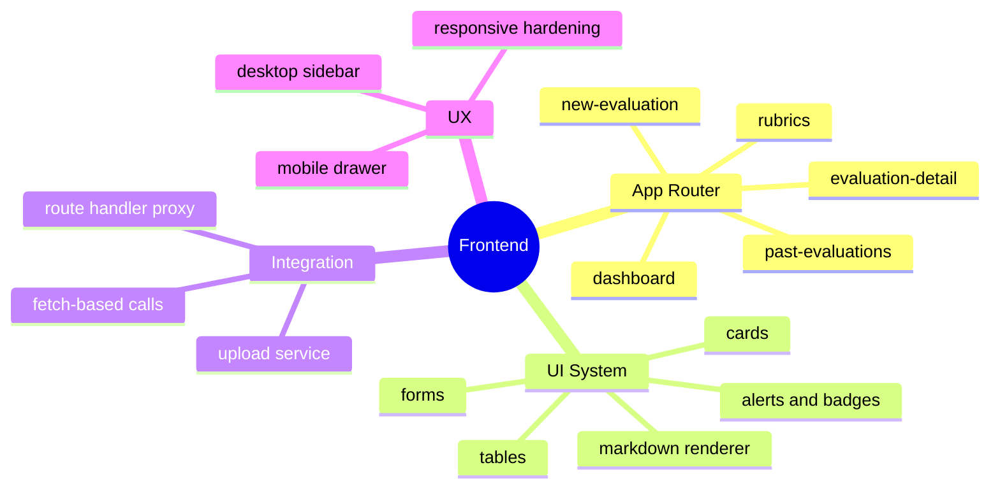
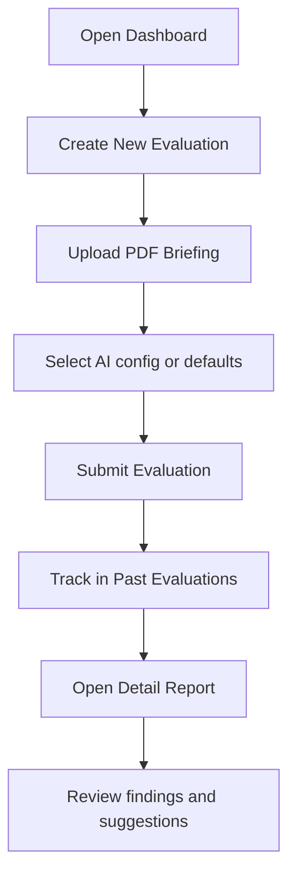
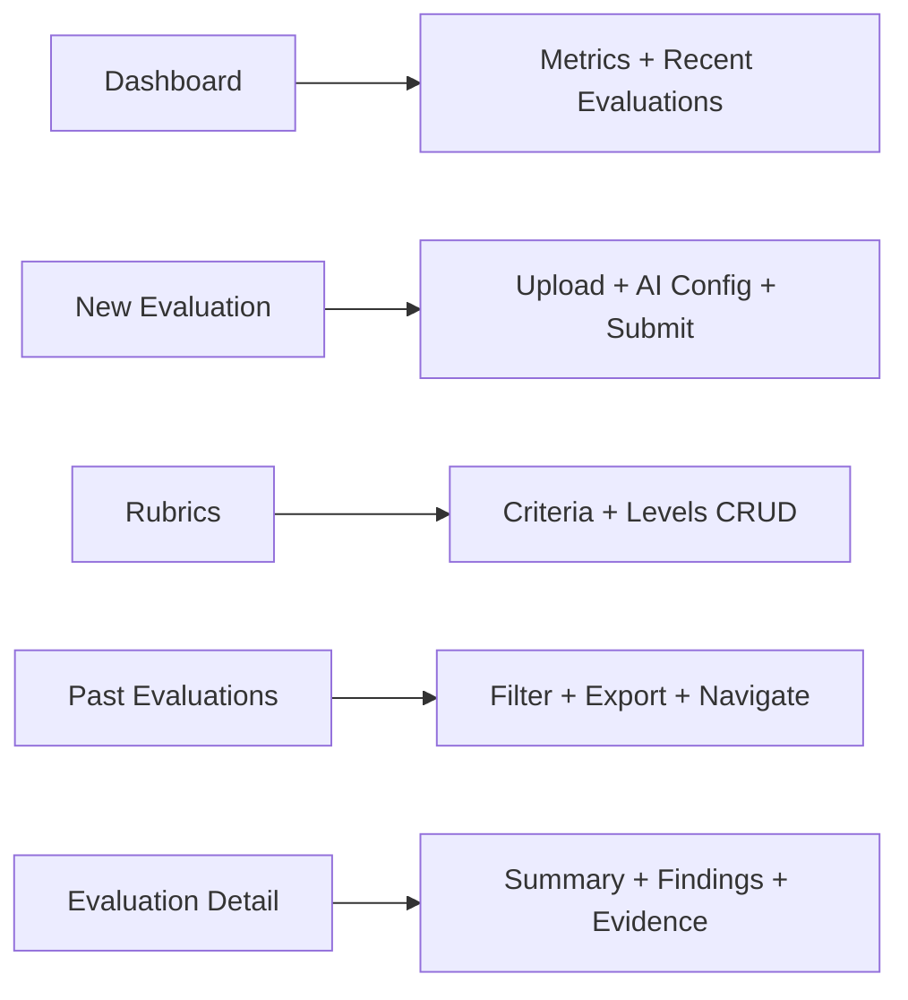
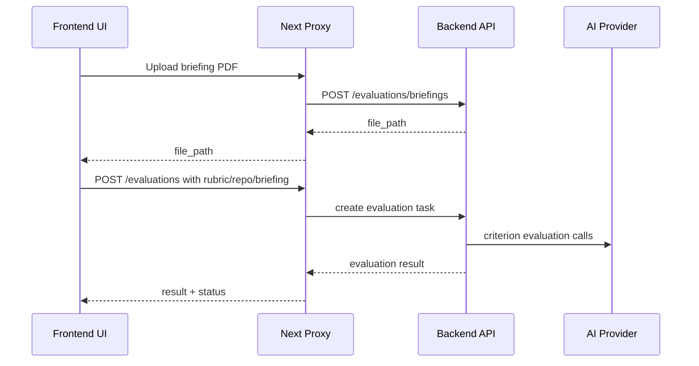

<div align="center">


# EvaluAI Frontend

### Modern UI for rubric-based AI repository evaluation

[](https://nextjs.org/)
[](https://react.dev/)
[](https://www.typescriptlang.org/)
[](https://tailwindcss.com/)
[](#architecture-overview)
[](#api--proxy-integration)

</div>

---

<div align="center">

### Quick Navigation

[](#product-overview)
[](#architecture-overview)
[](#pages--flows)
[](#components-gallery)
[](#api--proxy-integration)
[](#what-we-implemented-in-frontend)
[](#responsive-highlights)

</div>

---

## Product Overview

EvaluAI Frontend is the interactive layer of the platform.

It provides:
- Rubric-driven evaluation creation.
- Briefing PDF upload and validation.
- Configurable AI provider/model selection.
- Evaluation history with filters and CSV export.
- Detailed report rendering with markdown findings.
- Rubric and criteria management with level editing.

---

## Architecture Overview

```mermaid
flowchart LR
  U[User Browser] --> N[Next.js 16 App Router]
  N --> L[App Layout + Sidebar]
  N --> P[/api/v1 Catch-all Proxy]
  P --> B[FastAPI Backend]
  B --> DB[(PostgreSQL)]
  B --> AI[Gemini | Groq | OpenAI]
```

### Why this architecture works well

- Browser only talks to localhost:3000.
- Backend calls are proxied server-side through route handlers.
- Docker-internal hostnames are not exposed to the browser.
- Redirect handling for 307/308 is controlled and safe.

### Visual module map



---

## Tech Stack

| Area | Choice | Notes |
|---|---|---|
| Framework | Next.js 16.1.6 | App Router + Route Handlers |
| Runtime UI | React 19.2.3 | Client components for interactive pages |
| Language | TypeScript 5.x | Typed pages, services, and component props |
| Styles | Tailwind CSS v4 | Utility-first responsive styling |
| Markdown | react-markdown + remark-gfm | AI summary and finding rendering |
| HTTP | fetch (primary), Axios client available | Relative routes through proxy |
| Charts | Recharts | Metrics visualization |
| Icons | Lucide React | Consistent iconography |

---

## Pages and Flows

### Route table

| Route | Main purpose | File |
|---|---|---|
| / | Entry redirect to dashboard | app/page.tsx |
| /dashboard | KPIs + recent evaluations | app/(app)/dashboard/page.tsx |
| /new-evaluation | End-to-end creation flow | app/(app)/new-evaluation/page.tsx |
| /rubrics | Rubric CRUD and level management | app/(app)/rubrics/page.tsx |
| /past-evaluations | Search/filter/export history | app/(app)/past-evaluations/page.tsx |
| /past-evaluations/[id] | Full report detail and findings | app/(app)/past-evaluations/[id]/page.tsx |
| /components-demo | Visual playground | app/components-demo/page.tsx |

### User journey map



---

## Components Gallery

### Core UI components

| Component | Purpose | Typical usage |
|---|---|---|
| Button | Main actions | Save, submit, create |
| Input / Textarea | Form controls | URL, names, descriptions |
| Select | Provider/model/rubric selection | Controlled selections |
| FileUpload | PDF upload | Briefing ingestion |
| Card | Visual grouping | Dashboard and report sections |
| Badge | Status and metadata chips | Completed, score, weight |
| Alert | Inline feedback | Success/error notices |
| Table | Structured datasets | Evaluations history |
| StatCard | KPI cards | Dashboard metrics |
| MarkdownRenderer | AI result rendering | Summary, evidence, suggestions |
| RubricBuilder | Complex rubric authoring | Criteria and levels |

### Layout primitives

| Component | Responsibility |
|---|---|
| MainLayout | Sidebar + content shell |
| Sidebar | Desktop nav + mobile drawer |
| PageHeader | Reusable title/subtitle/action section |
| Container | Max-width and spacing control |

### Component examples

```tsx
import { Button, Card, CardContent, Badge, Select, Alert } from '@/components/ui';

<Card className="rounded-xl border border-gray-200">
  <CardContent className="space-y-4">
    <div className="flex items-center justify-between">
      <h3 className="text-lg font-semibold">Evaluation Status</h3>
      <Badge variant="success">Completed</Badge>
    </div>

    <Select
      label="AI Provider"
      options={[{ value: 'groq', label: 'Groq' }]}
      value="groq"
      onChange={() => {}}
      fullWidth
    />

    <Button variant="primary">Run Evaluation</Button>
    <Alert variant="success" message="Evaluation started successfully" />
  </CardContent>
</Card>
```

---

## Visual Documentation Blocks

This README stays fully visual without requiring external GIF assets.

### Architecture cards

| Layer | Description |
|---|---|
| Frontend UI | Pages, forms, tables, markdown report rendering |
| App Shell | Sidebar, mobile drawer, route layout boundaries |
| Proxy Layer | Next.js route handler for /api/v1/* forwarding |
| Backend Integration | FastAPI evaluation/rubric APIs |
| AI Providers | Gemini, Groq, OpenAI execution from backend |

### Feature surface map



### Component categories at a glance

| Category | Components |
|---|---|
| Inputs | Input, Textarea, Select, FileUpload |
| Feedback | Alert, Badge |
| Layout | Card, Container, MainLayout, PageHeader, Sidebar |
| Data display | Table, StatCard, MarkdownRenderer |
| Interaction | Button, DropdownMenu, Modal, SearchBar |
| Domain | RubricBuilder |

---

## API / Proxy Integration

### Request strategy

All user-facing pages call relative routes:
- /api/v1/evaluations/
- /api/v1/rubrics/
- /api/v1/evaluations/briefings

### Proxy layer

Implemented in app/api/v1/[...path]/route.ts.

It provides:
- Server-side forwarding to BACKEND_URL.
- Controlled redirect handling (307/308).
- Body-safe replay for redirects.
- Hop-by-hop header filtering.
- Safer upstream behavior for Docker development.

### HTTP client status

- Current page implementations mostly use fetch.
- Axios client exists in lib/api/client.ts for future standardized usage.

---

## Data and AI Flow



Provider UX behavior:
- Empty provider/model means backend defaults.
- Selected provider/model are sent explicitly.
- Optional user API key is forwarded via X-API-Key header.

---

## What We Implemented in Frontend

### Functional improvements

- Fixed forwarding of custom AI provider/model from the new evaluation form.
- Fixed optional API key forwarding through X-API-Key header.
- Aligned provider naming to groq across frontend types and selectors.
- Preserved server-default behavior when no custom provider/model is selected.

### UX and responsive hardening

- Improved mobile paddings for dashboard and evaluation views.
- Improved wrapping behavior for markdown text, links, and inline code.
- Added safer rendering behavior for markdown tables and long content blocks.
- Improved finding badges and metadata wrapping in narrow viewports.

### Reliability and developer experience

- Hardened route-handler proxy behavior and documentation.
- Clarified environment-variable behavior and container recreate requirements.
- Reworked README for faster onboarding and clearer architecture understanding.

---

## Project Structure

```text
frontend/
├── app/
│   ├── layout.tsx
│   ├── page.tsx
│   ├── (app)/
│   │   ├── layout.tsx
│   │   ├── dashboard/page.tsx
│   │   ├── new-evaluation/page.tsx
│   │   ├── rubrics/page.tsx
│   │   ├── past-evaluations/page.tsx
│   │   └── past-evaluations/[id]/page.tsx
│   ├── api/v1/[...path]/route.ts
│   └── components-demo/page.tsx
├── components/
│   ├── layout/
│   └── ui/
├── lib/
│   ├── api/client.ts
│   ├── services/file-upload.ts
│   └── utils/
├── hooks/
├── public/
├── types/
├── next.config.ts
├── package.json
└── README.md
```

---

## Environment Variables

Create file from template:

```bash
cp .env.example .env
```

| Variable | Scope | Purpose | Default |
|---|---|---|---|
| BACKEND_URL | Server-side only | Upstream backend target for proxy | http://backend:8000 |

Security notes:
- Do not store provider keys in frontend env files.
- Keep secrets in backend environment or user runtime input.

---

## Run and Build

### Local development

```bash
npm install
npm run dev
```

### Production

```bash
npm run build
npm run start
```

### Lint

```bash
npm run lint
```

---

## Docker Setup

### Dev image

- Dockerfile.dev
- Node 20-slim
- Volume-based hot reload
- Port 3000

### Prod image

- Dockerfile.prod
- Multi-stage standalone build
- Non-root runtime user
- Healthcheck enabled

When env values change, recreate frontend container:

```bash
docker compose -f docker-compose.dev.yml up -d --force-recreate frontend
```

---

## Responsive Highlights

### Covered improvements

- Mobile sidebar top bar and drawer flow.
- Adaptive spacing for dashboard, list, and detail pages.
- Wrap-safe rendering for markdown-heavy AI outputs.
- Better behavior for long lines, evidence snippets, and suggestion blocks.

### Manual QA checklist

- Viewport: 320x824
- Routes: /dashboard, /past-evaluations, /past-evaluations/[id]
- Validate:
  - no clipped text
  - no unintended horizontal overflow
  - markdown blocks remain readable

---

## Troubleshooting

### Backend unreachable

- Verify backend container status.
- Verify BACKEND_URL.
- Check route handler logs for proxy failures.

### UI changes not visible

1. Hard refresh browser.
2. Restart frontend container.
3. Recreate container if env changed.

### AI provider auth errors

- Validate active backend runtime env values.
- Check duplicated env keys overriding valid credentials.
- Confirm whether X-API-Key from UI is overriding server key.

---

## Contributing

1. Branch from development.
2. Follow existing component and Tailwind conventions.
3. Prefer reusing shared UI primitives.
4. Keep API calls relative to /api/v1.
5. Run lint before opening PR.
6. Include screenshots for UI changes when possible.

---

<div align="center">

### Designed for clean UX, resilient integration, and maintainable frontend evolution.

</div>
