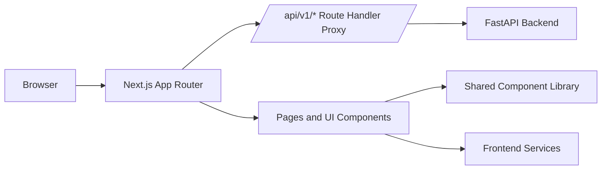

# EvaluAI Frontend

Frontend application for EvaluAI, the AI-powered repository evaluation platform.

This document is intentionally detailed so any developer can onboard quickly, understand the architecture, and contribute safely.

---

## 1. Tech Stack

| Area | Technology | Version | Purpose |
|---|---|---|---|
| Framework | Next.js (App Router) | 16.1.6 | Routing, SSR/CSR, API Route Handlers |
| UI | React | 19.2.3 | Component-based UI |
| Language | TypeScript | 5.x | Type safety and maintainability |
| Styling | Tailwind CSS | 4.x | Utility-first styling |
| Markdown | react-markdown + remark-gfm | 10.x / 4.x | Rendering AI summaries and findings |
| HTTP | Fetch + Axios client | Native / 1.13.x | API requests through proxy |
| Charts | Recharts | 3.7.0 | Dashboard visual metrics |
| Icons | Lucide React | 0.575.0 | Consistent icon system |

---

## 2. Frontend Architecture (High Level)



Key idea:
- The browser talks to `localhost:3000`.
- The frontend proxies backend requests server-side via `app/api/v1/[...path]/route.ts`.
- This avoids exposing internal Docker hostnames and reduces CORS complexity.

---

## 3. Route Map (Pages)

| Route | File | Purpose |
|---|---|---|
| `/` | `app/page.tsx` | Redirects to dashboard |
| `/dashboard` | `app/(app)/dashboard/page.tsx` | Metrics, most-used rubric, recent evaluations |
| `/new-evaluation` | `app/(app)/new-evaluation/page.tsx` | Create evaluation, upload briefing PDF, choose AI provider/model |
| `/rubrics` | `app/(app)/rubrics/page.tsx` | Manage rubric templates, criteria, levels |
| `/past-evaluations` | `app/(app)/past-evaluations/page.tsx` | Search/filter/export evaluations history |
| `/past-evaluations/[id]` | `app/(app)/past-evaluations/[id]/page.tsx` | Detailed evaluation report and findings |
| `/components-demo` | `app/components-demo/page.tsx` | Internal component showcase |

---

## 4. Layout System

| Layer | File | Responsibility |
|---|---|---|
| Root layout | `app/layout.tsx` | Global fonts, base metadata, hydration warning handling |
| App shell layout | `app/(app)/layout.tsx` | Sidebar navigation and mobile drawer |
| Layout primitives | `components/layout/Container.tsx` | `MainLayout`, `PageHeader`, `Container` |
| Sidebar | `components/layout/Sidebar.tsx` | Desktop sidebar + mobile overlay drawer |

Mobile behavior highlights:
- Hamburger top bar on small screens.
- Sidebar drawer with backdrop and close controls.
- Responsive paddings and wrapped metadata in detail/list pages.

---

## 5. API Integration Strategy

### 5.1 Proxy Route Handler

File: `app/api/v1/[...path]/route.ts`

What it does:
- Proxies all `/api/v1/*` requests to `BACKEND_URL`.
- Follows `307/308` redirects manually and safely.
- Preserves method/body when redirecting.
- Filters hop-by-hop headers.
- Rejects cross-origin redirect hops to avoid SSRF-style abuse.

Why this exists:
- Turbopack can be unreliable with rewrite-based proxying in dev.
- Route Handler proxy keeps network flow stable and Docker-safe.

### 5.2 Request Pattern in Pages

Most pages use relative URLs:

```ts
fetch('/api/v1/evaluations/')
fetch('/api/v1/rubrics/')
```

This ensures all traffic goes through the proxy.

### 5.3 File Upload Flow

File: `lib/services/file-upload.ts`

Flow:
1. Validate file extension and size client-side.
2. POST multipart file to `/api/v1/evaluations/briefings`.
3. Receive `file_path` from backend.
4. Submit evaluation payload with that `briefing_path`.

---

## 6. AI Provider Configuration (Frontend Behavior)

Configured in `app/(app)/new-evaluation/page.tsx`.

Supported providers in UI:
- `gemini`
- `groq`
- `openai`

Behavior:
- If provider/model are empty, frontend sends no custom AI config and backend defaults are used.
- If provider/model are selected, they are included in request body.
- If user provides API key, frontend sends it as `X-API-Key` header.

Important note:
- Backend validation rules determine whether a custom provider/model requires explicit API key.

---

## 7. Component Library Overview

### 7.1 UI Components (`components/ui`)

| Component | Role |
|---|---|
| `Alert.tsx` | Success/error dismissible banners |
| `Badge.tsx` | Status labels and semantic pills |
| `Button.tsx` | Button variants, sizes, loading states |
| `Card.tsx` | Generic card containers and sections |
| `DropdownMenu.tsx` | Context/action menus |
| `FileUpload.tsx` | Upload input with drag/drop UX |
| `Input.tsx` | Text input with helper/error states |
| `MarkdownRenderer.tsx` | Safe markdown rendering for summaries/findings |
| `Modal.tsx` | Generic modal dialogs |
| `RubricBuilder.tsx` | Rubric form builder (criteria + levels) |
| `SearchBar.tsx` | Search UX with clean interaction |
| `Select.tsx` | Controlled select component |
| `StatCard.tsx` | Dashboard KPI cards |
| `Table.tsx` | Reusable table primitives |
| `Textarea.tsx` | Multiline input component |

Additional docs:
- `components/UI_COMPONENTS.md`

### 7.2 Layout Components (`components/layout`)

| Component | Role |
|---|---|
| `Container.tsx` | Width constraints and page primitives |
| `Sidebar.tsx` | Primary navigation (desktop + mobile drawer) |
| `index.ts` | Layout exports |

---

## 8. Project Structure

```text
frontend/
├── app/
│   ├── layout.tsx
│   ├── page.tsx
│   ├── (app)/
│   │   ├── layout.tsx
│   │   ├── dashboard/page.tsx
│   │   ├── new-evaluation/page.tsx
│   │   ├── past-evaluations/page.tsx
│   │   ├── past-evaluations/[id]/page.tsx
│   │   └── rubrics/page.tsx
│   ├── api/v1/[...path]/route.ts
│   └── components-demo/page.tsx
├── components/
│   ├── layout/
│   └── ui/
├── lib/
│   ├── api/client.ts
│   ├── services/file-upload.ts
│   └── utils/
├── hooks/
├── public/
├── types/
├── next.config.ts
├── package.json
└── README.md
```

---

## 9. Environment Variables

Use `.env.example` as base.

```bash
cp .env.example .env
```

Variables:

| Variable | Scope | Default | Description |
|---|---|---|---|
| `BACKEND_URL` | Server-side | `http://backend:8000` | Backend base URL used only by route handler proxy |

Security notes:
- Do not put provider API keys in frontend env files.
- Provider keys should come from runtime input (BYOK) or backend env.
- Keep `.env` files out of commits when they contain secrets.

---

## 10. Development

### 10.1 Prerequisites

- Node.js 20+
- npm 10+

### 10.2 Local Run

```bash
npm install
npm run dev
```

App URL:
- `http://localhost:3000`

### 10.3 Available Scripts

```bash
npm run dev
npm run build
npm run start
npm run lint
```

---

## 11. Docker Workflow

### 11.1 Development image

File: `Dockerfile.dev`

- Base: `node:20-slim`
- Uses volume mounts for hot reload in Compose
- Exposes port `3000`

### 11.2 Production image

File: `Dockerfile.prod`

- Multi-stage build
- `next build` + standalone output
- Non-root runtime user
- Healthcheck included

Important operational note:
- If env vars change in Compose `env_file`, use container recreate (not only restart):

```bash
docker compose -f docker-compose.dev.yml up -d --force-recreate frontend
```

---

## 12. Responsive Design Notes

Current responsive strategy includes:
- Mobile drawer navigation (`Sidebar` + `MainLayout`).
- Adaptive paddings across dashboard/history/detail pages.
- Wrapped metadata badges and compact card spacing on small screens.
- `MarkdownRenderer` tuned for long content, code blocks, links, and table cells.

Testing checklist for 320px width:
- Dashboard cards and recent table header spacing.
- Past evaluations filters and row metadata wrapping.
- Evaluation detail findings, suggestions, and markdown blocks.

---

## 13. Code Quality and Conventions

- TypeScript-first components and interfaces.
- Strongly-typed API response handling in pages.
- Keep UI logic close to pages, extract reusable logic to `lib/services`.
- Prefer relative API paths (`/api/v1/...`) to guarantee proxy usage.
- Keep component styles consistent with existing design language.

Recommended commit style:
- Conventional commits (`feat:`, `fix:`, `docs:`, `refactor:`).

---

## 14. Troubleshooting

### 14.1 Proxy cannot reach backend

Symptoms:
- `502` from frontend API route

Checks:
- Backend container running
- Correct `BACKEND_URL`
- Backend route availability (`/api/v1/...`)

### 14.2 Frontend changes not reflected

Actions:
1. Hard refresh browser (`Ctrl+Shift+R`)
2. Restart frontend container
3. If env changed, recreate container with `--force-recreate`

### 14.3 Markdown overflow on mobile

Check:
- `components/ui/MarkdownRenderer.tsx`
- Ensure wrapper and table/code rules still include responsive wrapping behavior

---

## 15. Contribution Guide

1. Create a feature branch from `development`.
2. Implement changes with TypeScript + existing UI conventions.
3. Run `npm run lint`.
4. Open PR with clear scope, screenshots (if UI), and testing notes.

---

## 16. Quick Reference

| Need | Where to look |
|---|---|
| Navigation shell | `app/(app)/layout.tsx`, `components/layout/Sidebar.tsx` |
| API proxy behavior | `app/api/v1/[...path]/route.ts` |
| New evaluation flow | `app/(app)/new-evaluation/page.tsx` |
| Markdown rendering | `components/ui/MarkdownRenderer.tsx` |
| Shared upload logic | `lib/services/file-upload.ts` |
| Next config and redirects | `next.config.ts` |

---

If you are new to this codebase, start with:
1. `app/(app)/layout.tsx`
2. `app/(app)/new-evaluation/page.tsx`
3. `app/api/v1/[...path]/route.ts`

That sequence gives you the fastest understanding of structure, business flow, and infrastructure.
